# NotesApp

<h1>This is Notes App .</h1>
<ul><li>Login</li><li>Add Note</li><li>Delete Note</li><li>See Note</li><li>Edit Note</li><li>Logout</li>
</ul>

When you will give wrong user name  and Paswword 

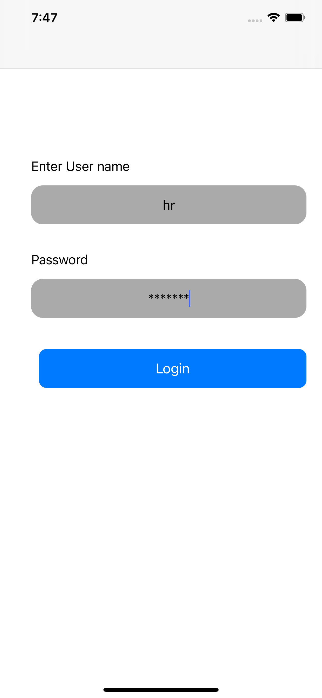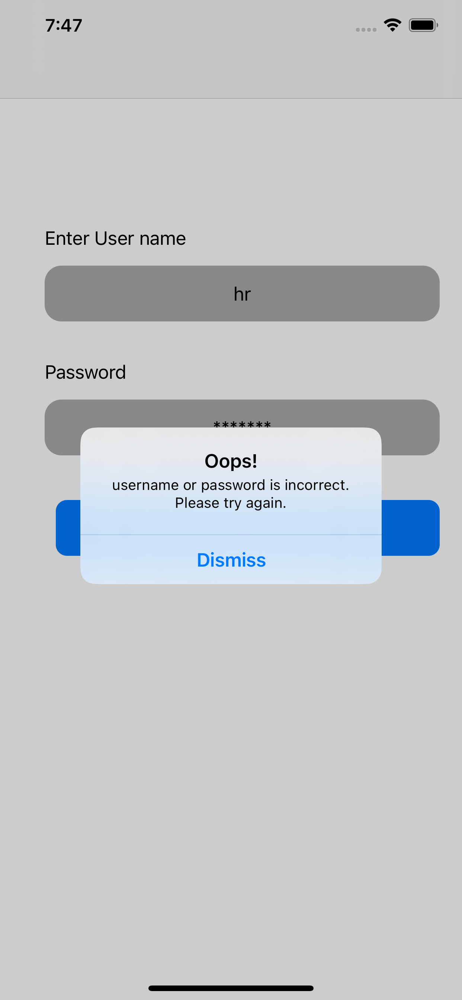

This will when you will give right username with 4* password

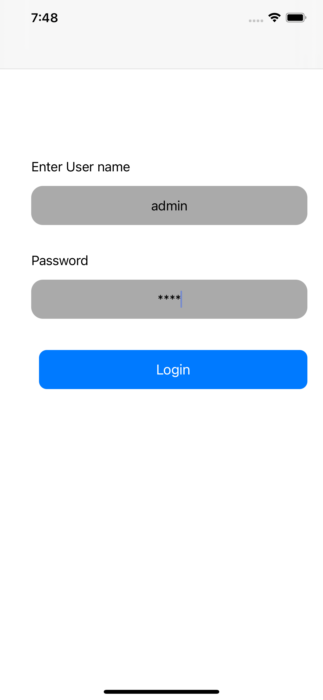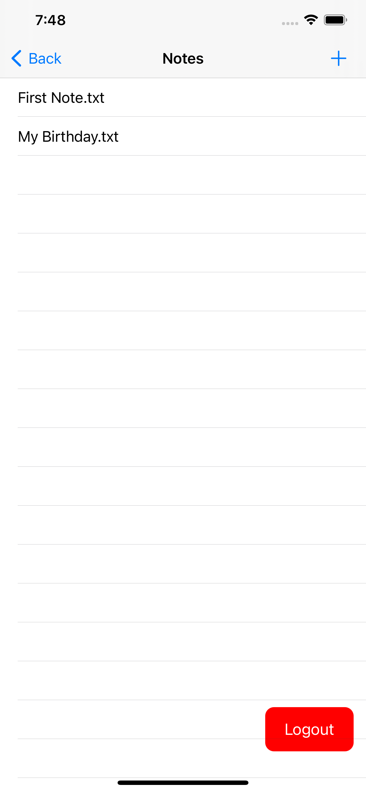

If you want to add New Note the Default screen will be

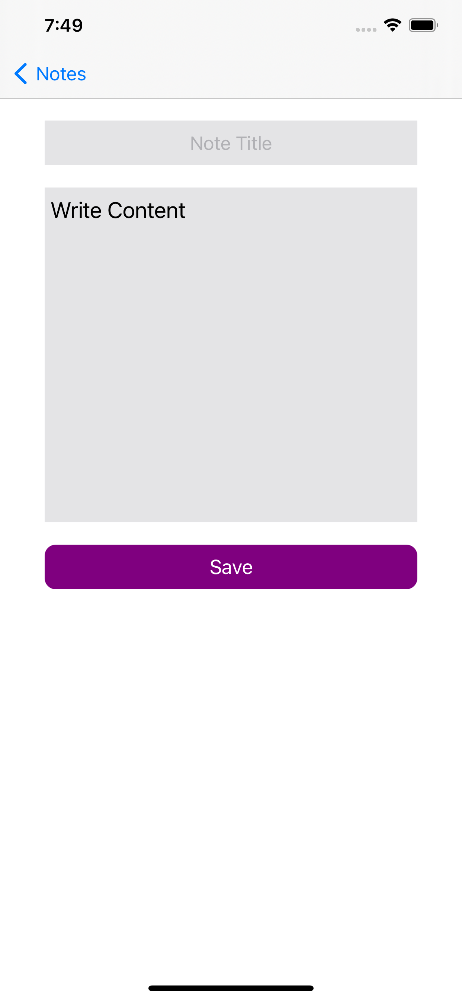

this will if After your writing

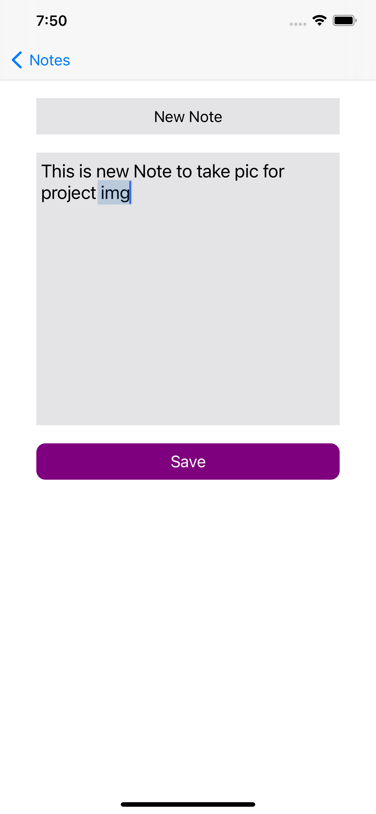

If you want to delete the Note then this

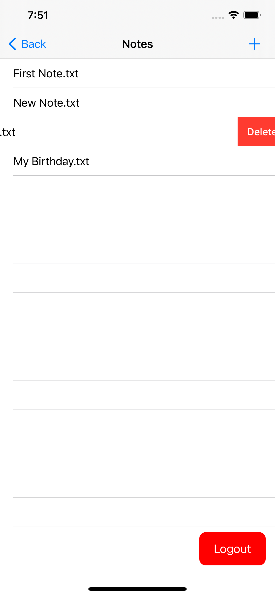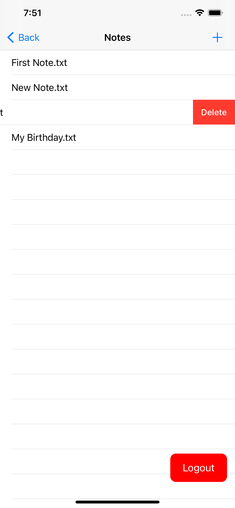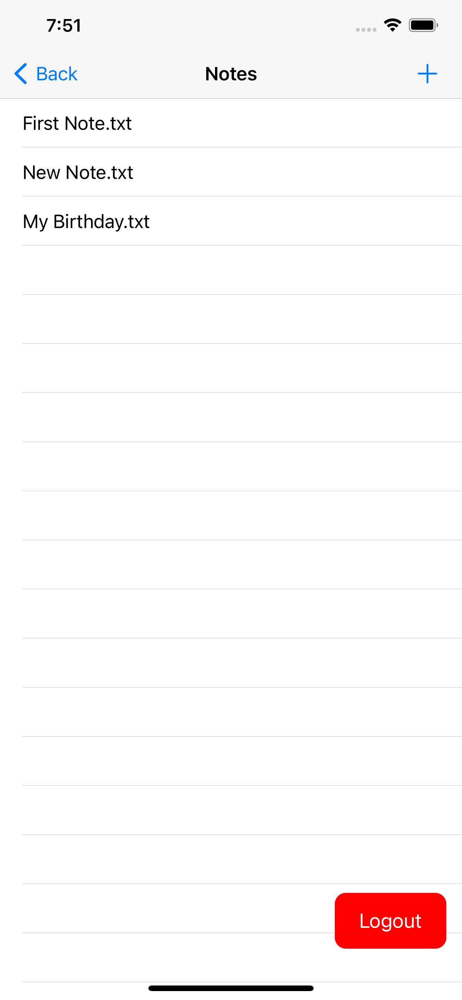

In this you can just see the note you cant edit it if you want to edit then click on edit buttton

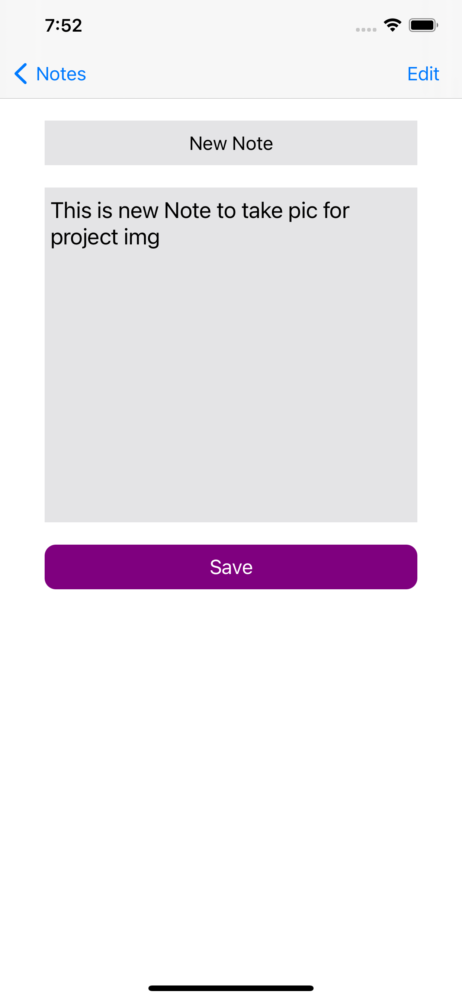

After you press edit and make changes

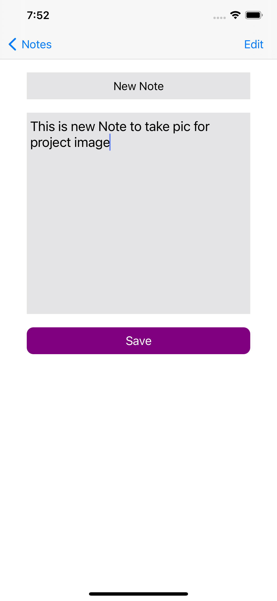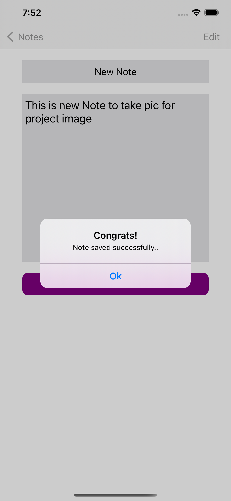

After you click on Logout button you will be gone to Login Screen

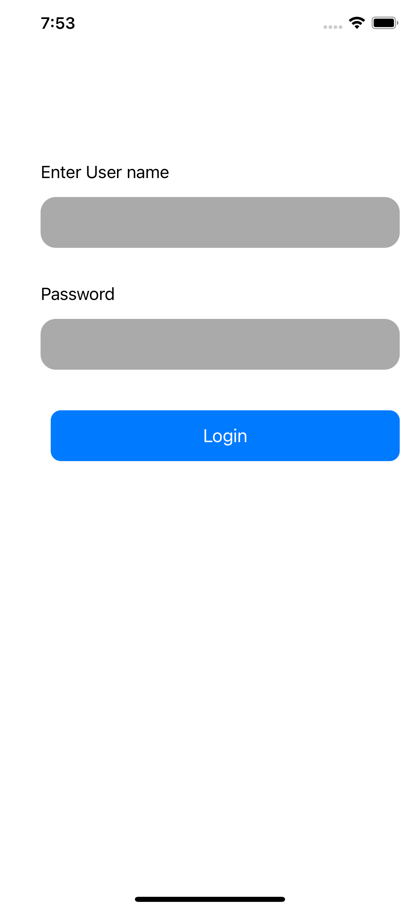

